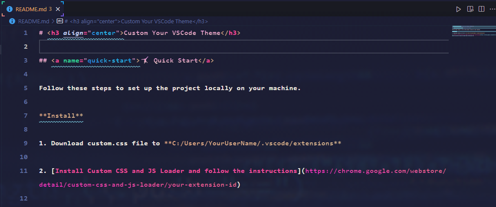

# <h3 align="center">Custom Your VSCode Theme</h3>

## <a name="quick-start">🤸 Quick Start</a>

Follow these steps to set up the project locally on your machine.

**Install**

1. Download custom.css file to **C:/Users/YourUserName/.vscode/extensions**

2. [Install Custom CSS and JS Loader and follow the instructions](https://marketplace.visualstudio.com/items?itemName=be5invis.vscode-custom-css)
